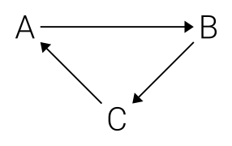

# haskell-id-containers

A collection of data containers where every element has a persistent identifier. These merely provide an convient interface (for some specific use cases) for some data structures from Haskell's `containers` and `unordered-containers` packages.

## Example
The order of arguments is specifically suitable for use with Haskell's `State` monad. For example, consider the fragment below which builds the following (cyclic) graph:


```haskell
-- | A graph, where each node is represented by a label with a reference to the
-- next node
graph :: State (IdList (String, Identifier)) ()
graph =
  do
    aId <- state $ IdList.append ("A", undefined)
    cId <- state $ IdList.append ("C", aId)
    bId <- state $ IdList.append ("B", cId)
    modify $ IdList.replace aId ("A", bId)
```
